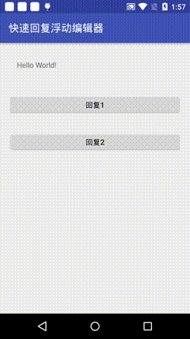

# floatingeditor
A quick reply to the android library floating editor

[](https://www.apache.org/licenses/LICENSE-2.0)

 android 浮动编辑器

## 预览



## 1.用法
下载工程后使用
```java
compile project(':floatingeditor')
```

## 2.功能
 * 浮动编辑器，使编辑界面始终浮于软键盘的上方


## 3.代码演示 也可参考demo中的代码

### 1.在布局文件中加入BannerViewPager
根据实际需求自定义浮动布局文件

### 2.调用
```java
    IEditor editorListener = new IEditor(){

            @Override
            public void onCancel() {
                //onCancel callback
            }

            @Override
            public void onSubmit(String content) {
                //onSubmit callback
            }
        }

    FloatEditorActivity.openEditor(context, editorListener,
                        new EditorHolder(R.layout.fast_reply_floating_layout,//Custom layout
                                R.id.tv_cancel, R.id.tv_submit, R.id.et_content));//The cancel view id,submit view id and The submit view id of The Custom layout.
                                
```

License
--------

    Copyright 2017 kevin.

    Licensed under the Apache License, Version 2.0 (the "License");
    you may not use this file except in compliance with the License.
    You may obtain a copy of the License at

       http://www.apache.org/licenses/LICENSE-2.0

    Unless required by applicable law or agreed to in writing, software
    distributed under the License is distributed on an "AS IS" BASIS,
    WITHOUT WARRANTIES OR CONDITIONS OF ANY KIND, either express or implied.
    See the License for the specific language governing permissions and
    limitations under the License.
